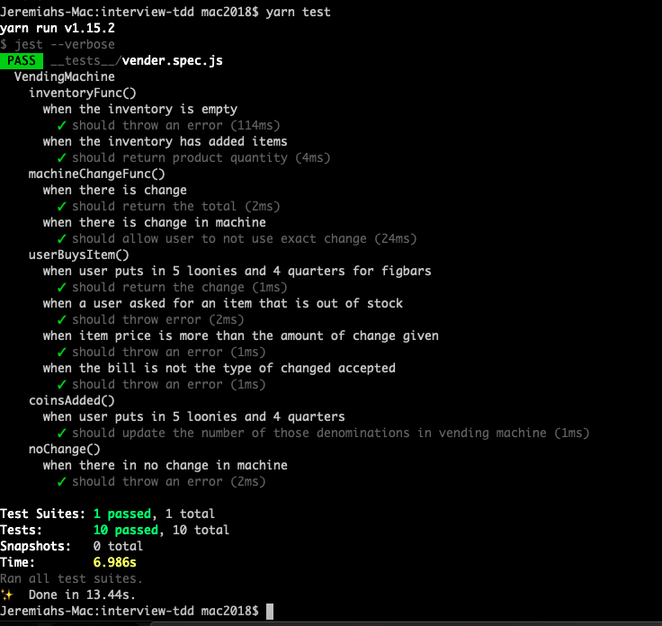

# Boomtown 🏙

### ScreenShot



---

## Description

This project displays my abilities to run TDD. It shows ten different tests that prove the functions work.

---

## Installation

Install yarn:

```bash
yarn install
```

### Technologies Used

- Jest
- JavaScript

---

## Author

- Name: Jeremiah
- My [Linkin](https://www.linkedin.com/in/jeremiah-aguirre-606708181/)

## Am I missing some essential feature?

- **Nothing is impossible!**

- Open an [issue](https://github.com/jeremiahaguirre/Interview-Project--TDD/issues/new)

- _Bug reports, feature requests, patches, and well-wishes are always welcome._ :heavy_exclamation_mark:
